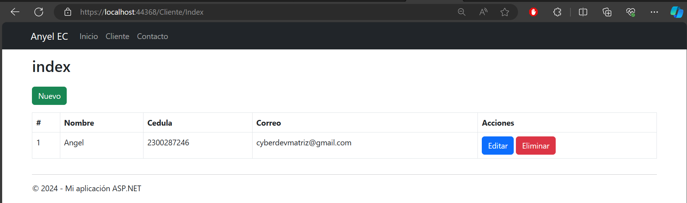
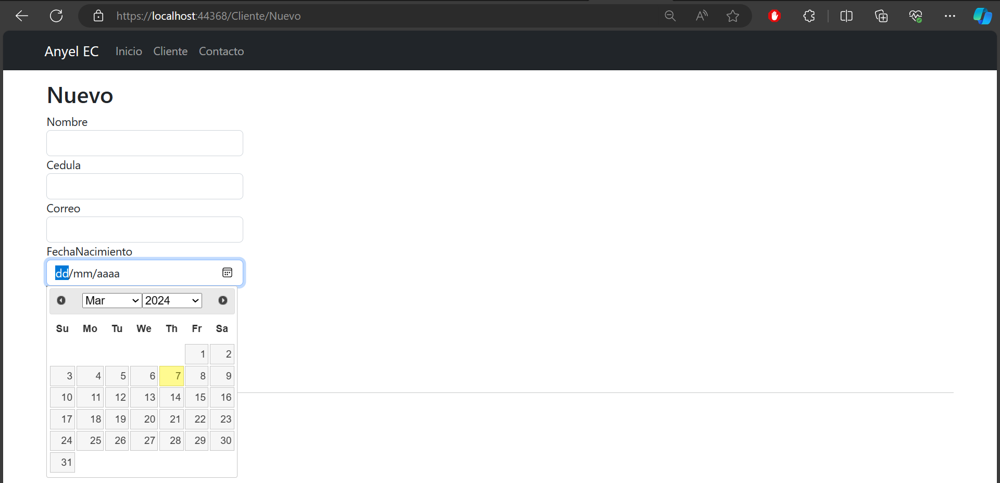
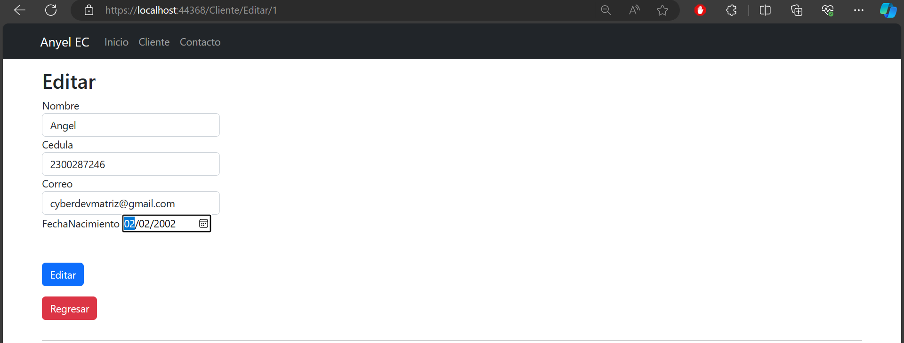
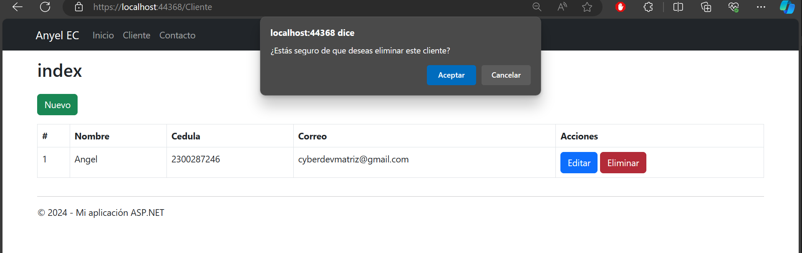
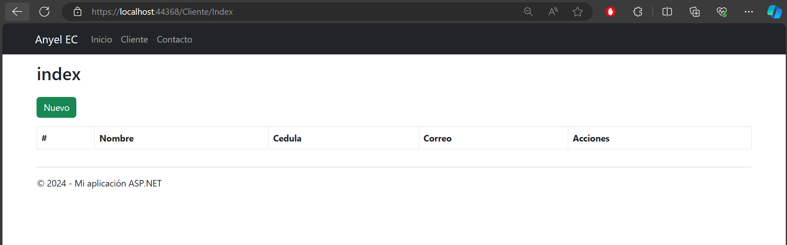

# MVC Application for Client Management - CRUD in MSSQL

This ASP.NET MVC application is designed to manage clients in an MSSQL database, allowing CRUD operations (Create, Read, Update, Delete) on the "Cliente" entity. The application includes three main views: **Index**, **Nuevo** (New), and **Editar** (Edit).


### **Select Language:**
- [Español (Spanish)](README-es.md)
- [English](README.md)

## Result
### Home
 
### New Client
 
### Edit Client
 
### Delete
 
### Delete After
 


## Table of Contents
1. [Initial Setup](#initial-setup)
2. [Project Structure](#project-structure)
3. [Main Views](#main-views)
4. [Cliente Model](#cliente-model)
5. [Cliente Controller](#cliente-controller)
6. [Database](#database)

---

### Initial Setup

Before running the application, ensure that your MSSQL database is configured and update the connection string in the `web.config` file.

```xml
<connectionStrings>
    <add name="lab2Entities" connectionString="YourConnectionString" providerName="System.Data.SqlClient" />
</connectionStrings>
```

---

### Project Structure

- **Models:** Contains model classes for the Cliente entity and the view model used in the Index view.
- **Views/Cliente:** Contains the Index, Nuevo, and Editar views.
- **Controllers:** Contains the `ClienteController` controller that manages CRUD operations.
- **Scripts:** Contains jQuery scripts for datepicker functionality.
- **Content:** Contains CSS style files.

---

### Main Views

#### Index.cshtml
The main view displaying a table with the list of clients. Allows editing and deletion operations.

#### Nuevo.cshtml
Enables adding new clients through a form. Includes data validation using Data Annotations and a jQuery datepicker for selecting birthdates.

#### Editar.cshtml
Similar to Nuevo.cshtml, but designed for editing existing clients.

---

### Cliente Model

```csharp
public class ClienteViewModel
{
    // Properties of the Cliente model
    // ...
}

public class ListClienteViewModel
{
    // Properties of the ListClienteViewModel model
    // ...
}
```

---

### Cliente Controller

The `ClienteController` controller handles CRUD operations for the Cliente entity. Some key actions include:

- **Index:** Displays the list of clients.
- **Nuevo:** Allows adding a new client.
- **Editar:** Allows editing an existing client.
- **Eliminar:** Allows deleting a client.

---

### Database

The application uses an MSSQL database named `lab2Entities`. Ensure that the `cliente` table with the necessary fields is created. You can use Entity Framework Code First Migrations to manage database migrations.

---

We hope this application proves useful! If you encounter any issues or have suggestions for improvement, feel free to contribute to the project. Thank you for using this ASP.NET MVC application!